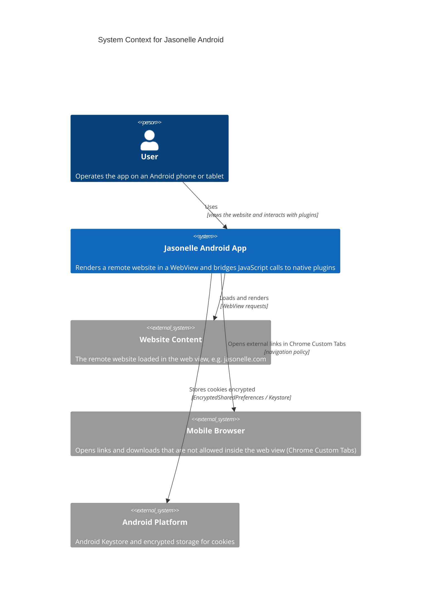
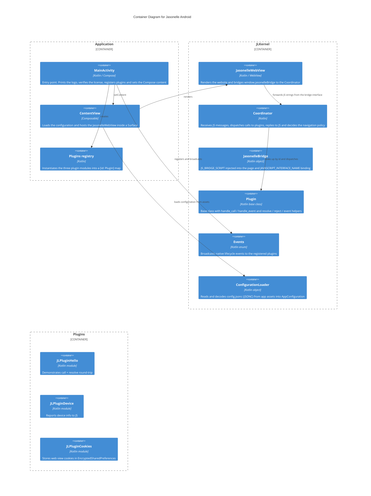
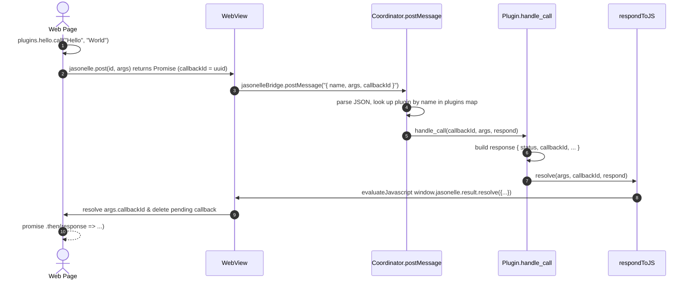
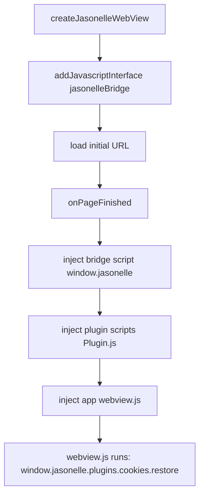
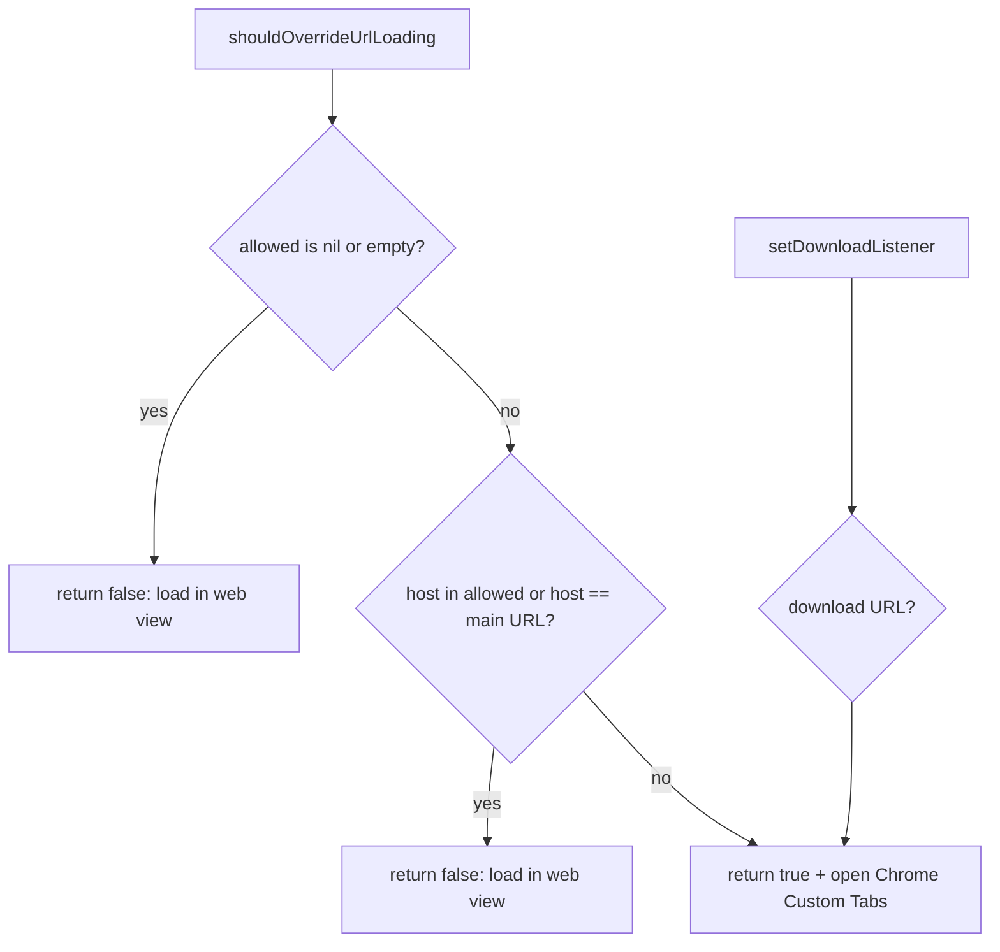
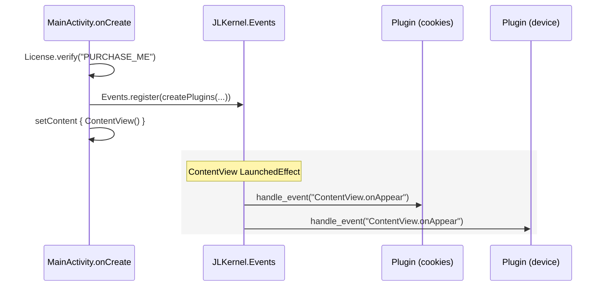

# Android Project

The Android source project for Jasonelle. It is a native Kotlin app (Jetpack
Compose) that renders a website inside a `WebView` and bridges JavaScript calls
to native Kotlin plugins through a bidirectional message channel, mirroring the
iOS (Xcode) implementation.

## Repository layout

| Path | Contents |
|------|----------|
| `gradlew`, `gradle/` | Gradle wrapper used to build every module. |
| `settings.gradle.kts` | Declares the modules: `:Application`, `:JLKernel` and the three plugins. |
| `Application/` | The Android app module. Contains the Compose `MainActivity`, `ContentView`, the plugin registry, assets (`config.jsonc`, `webview.js`) and the `AndroidManifest.xml`. |
| `JLKernel/` | The core library: `JasonelleWebView`, `Coordinator`, `JasonelleBridge`, `Plugin`, `Events`, `ConfigurationLoader`, `Logger`, `Version` and `License`. |
| `JLPluginHello/` | A sample plugin that demonstrates the native–JavaScript bridge. |
| `JLPluginDevice/` | A plugin that reports device information to JavaScript. |
| `JLPluginCookies/` | A plugin that persists web view cookies in encrypted storage. |
| `local.properties` | Local SDK path (gitignored, not committed). |
| `Taskfile.yml` | `task build`, `task test`, `task assemble`, `task lint` wrap the Gradle tasks. |

## Architecture

Jasonelle Android follows the same layered architecture as the iOS project. The
**Application** module owns the activity lifecycle and the registered plugin
instances. The **JLKernel** module provides the web view, the JavaScript bridge
and the message routing. The **plugins** modules implement native features
callable from JavaScript.

### System Context (C4 L1)



### Containers (C4 L2)



### The JavaScript Bridge

The bridge is a bidirectional message channel between the page loaded in the
`WebView` and native code.

- The native side registers the `Coordinator` as a JavaScript interface named
  `jasonelleBridge` with `addJavascriptInterface`.
- `JasonelleBridge.JS_BRIDGE_SCRIPT` defines `window.jasonelle` with
  `post(name, args)`, `result.resolve`, `result.reject` and `plugin.init`.
- Each plugin's `Plugin.js` registers itself on
  `window.jasonelle.plugins.<name>`.
- `post` stringifies `{ name, args, callbackId }` and calls
  `window.jasonelleBridge.postMessage(json)`.
- The `Coordinator.postMessage` (`@JavascriptInterface`) parses the JSON, looks
  up the plugin and invokes `handle_call(callbackId, args, respond)`. Plugins
  reply through `resolve` or `reject`, which evaluate
  `window.jasonelle.result.resolve|reject(...)` back in the page on the main
  thread.

Because the bridge script also installs a `window.webkit.messageHandlers.*`
shim, the same `Plugin.js` files work unchanged on Android and iOS.



The message body (JSON stringified by `post`) is:

```json
{ "name": "com.jasonelle.plugins.hello", "args": ["Hello", "World"], "callbackId": "<uuid>" }
```

`name` is the **plugin id** (reverse domain notation), which is also the key in
the plugins map registered by the application.

### Script injection

Android WebView has no document-start/end user scripts, so the bridge, plugin
and app scripts are all evaluated from `onPageFinished`, in the same order as
iOS injects them. The `jasonelleBridge` native interface is available before
the first load, so early page code can still call it.



### Navigation policy

The app keeps the user inside the web view unless the destination is not
allowed, in which case it opens Chrome Custom Tabs (falling back to a browser
intent). Downloads are also handed to Custom Tabs.



### Native events

Native code notifies all registered plugins about lifecycle events. The app
registers plugins in `MainActivity.onCreate` and broadcasts when the
`ContentView` first appears:



## JLKernel components

| Component | Responsibility |
|-----------|----------------|
| `JasonelleWebView` | Compose composable built on `AndroidView`; creates the `WebView` via `createJasonelleWebView` and loads the configured URL. |
| `Coordinator` | `@JavascriptInterface` receiver for JS messages, plus the navigation policy. `handleMessage` and `decidePolicyForHost` are extracted for JVM unit testing. |
| `JasonelleBridge` | Holds `JS_BRIDGE_SCRIPT` (injected into the page) and the interface name `jasonelleBridge`. |
| `Plugin` | Base class every plugin subclasses. Provides `name`/`id` defaults, `handle_call`, `handle_event`, the `resolve`/`reject`/`event` helpers and the `js()` loader that reads `plugins/<name>/Plugin.js` from assets. |
| `Events` | Enum of native events with a static plugin registry, `register(plugins:)` and `sendOnAppear()`. |
| `ConfigurationLoader` | Loads `config.jsonc` from app assets, strips comments (`//` and `/* */`) and decodes it into `AppConfiguration` (`urlString`, `inspectable`, `allowed`). |
| `Logger` | Structured logging with `LogLevel` severities and Ratlog-format output via `Ratlog`. |
| `Version` | Reads the bundled `VERSION` resource and returns the semantic version. |
| `License` | Verifies a Jasonelle license key. |

### Plugins

Each plugin is an independent Gradle module that subclasses `JLKernel.Plugin`
(imported as `KernelPlugin` to avoid the class-name clash). Plugins are
composed by the **Application** in `Plugins.kt`, which instantiates them; the
Cookies plugin receives the application `Context`. Keys must match the plugin
id used in JavaScript (`window.jasonelle.plugins.<name>`).

| Plugin | Native API | JS object |
|--------|-----------|-----------|
| `JLPluginHello` | `handle_call` echoes a response | `plugins.hello.call()` |
| `JLPluginDevice` | `handle_call` returns device info | `plugins.device.info()` |
| `JLPluginCookies` | `handle_call` stores/reads cookies in `EncryptedSharedPreferences` | `plugins.cookies.save()`, `restore()`, `persist()` |

## Development

- Build all modules with `task build` (`./gradlew assembleDebug`).
- Run `task test` (`./gradlew test`) for the JVM unit tests in every module
  (`JLKernelTests`, `JLPluginHelloTests`, `JLPluginDeviceTests`,
  `JLPluginCookiesTests`).
- Build just the app APK with `task assemble`
  (`./gradlew :Application:assembleDebug`), output in
  `Application/build/outputs/apk/debug/`.
- Run lint with `task lint`.
- Every plugin ships a `docs/<Plugin>.md` file describing its native code and
  JavaScript bridge.