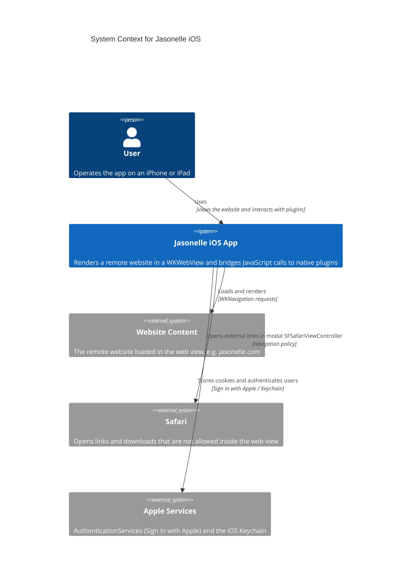
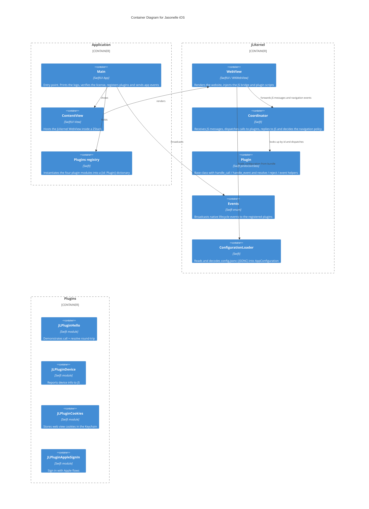
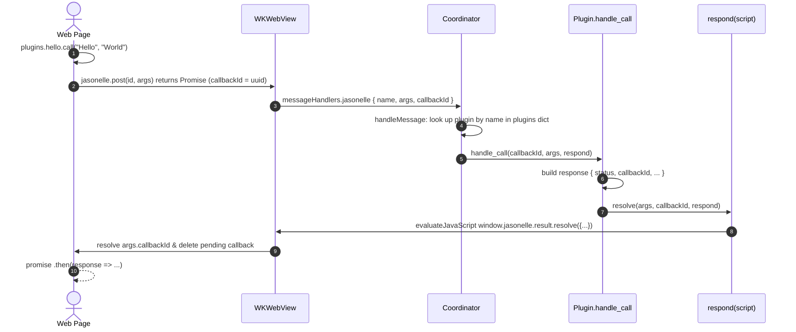
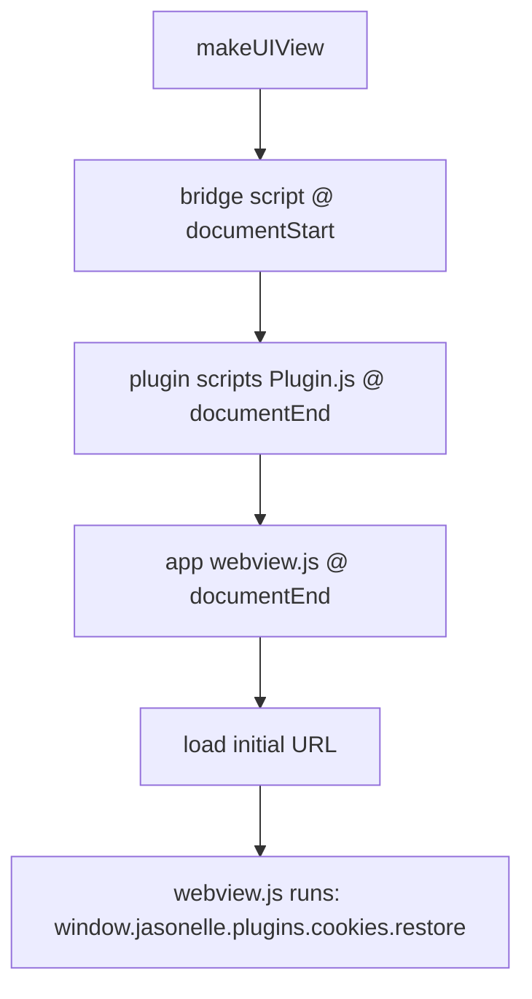
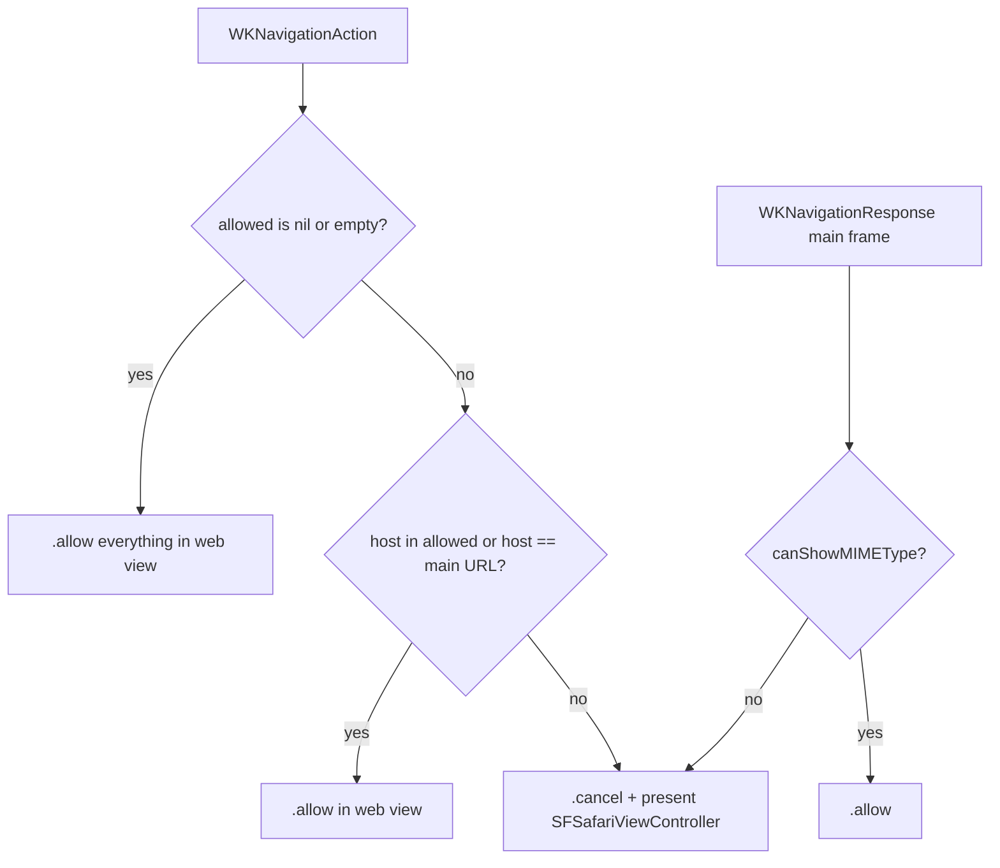
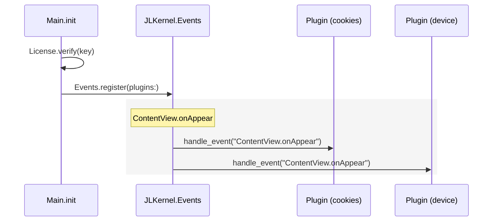

# Xcode (iOS) Project

The iOS source project for Jasonelle. It is a native SwiftUI app that renders a
website inside a `WKWebView` and bridges JavaScript calls to native Swift
plugins through a bidirectional message channel.

## Repository layout

| Path | Contents |
|------|----------|
| `Jasonelle.xcworkspace/` | Xcode workspace that groups the app, the kernel framework and the plugins. |
| `Application/` | The iOS app target. Contains SwiftUI views, resources (`Assets.xcassets`), `config.jsonc`, `webview.js` and the `Application.docc` documentation. |
| `JLKernel/` | A reusable framework consumed by the app: `WebView`, `Coordinator`, `Plugin`, `Events`, `ConfigurationLoader`, `Logger`, `Version` and `License`. |
| `JLPluginHello/` | A sample plugin that demonstrates the native–JavaScript bridge. |
| `JLPluginDevice/` | A plugin that reports device information to JavaScript. |
| `JLPluginCookies/` | A plugin that persists web view cookies in the iOS Keychain. |
| `JLPluginAppleSignIn/` | A plugin that provides Sign in with Apple. |
| `.swiftlint.yml` | SwiftLint rules. |
| `.clang-format` | Formatting rules for C/C++/Objective-C sources. |
| `Taskfile.yml` | `task lint` / `task fix` run SwiftLint. |

## Architecture

Jasonelle iOS follows a layered architecture. The **Application** layer owns the
SwiftUI lifecycle and the registered plugin instances. The **JLKernel** layer
provides the web view, the JavaScript bridge and the message routing. The
**plugins** layer implements native features callable from JavaScript.

### System Context (C4 L1)



### Containers (C4 L2)



### The JavaScript Bridge

The bridge is a bidirectional message channel between the page loaded in the
`WKWebView` and native code.

- `WebView.jsBridgeScript` is injected at **document start** and defines the
  `window.jasonelle` object with `post(name, args)`, `result.resolve`, `result.reject`
  and `plugin.init`.
- Each plugin's `Plugin.js` is injected at **document end** and registers itself
  on `window.jasonelle.plugins.<name>`.
- JavaScript posts a message to `window.webkit.messageHandlers.jasonelle`.
- The `Coordinator` resolves the message to a plugin and invokes
  `handle_call(callbackId:args:respond:)`; plugins reply through `resolve` or
  `reject`, which evaluate `window.jasonelle.result.resolve|reject(...)` back in
  the page.



The message body is a dictionary:

```json
{ "name": "com.jasonelle.plugins.hello", "args": ["Hello", "World"], "callbackId": "<uuid>" }
```

`name` is the **plugin id** (reverse domain notation), which is also the key in
the plugins dictionary registered by the application.

### Script injection order



### Navigation policy

The app keeps the user inside the web view unless the destination is not
allowed, in which case it opens a modal `SFSafariViewController`.



### Native events

Native code notifies all registered plugins about lifecycle events. The app
registers plugins once in `Main.init()` and broadcasts on `ContentView.onAppear`:



## JLKernel components

| Component | Responsibility |
|-----------|----------------|
| `WebView` | SwiftUI `UIViewRepresentable` that creates the `WKWebView`, registers the message handler, injects the bridge, plugin and app scripts, and applies the navigation delegate. |
| `Coordinator` | `WKNavigationDelegate` + `WKScriptMessageHandler`. Routes JavaScript messages to plugins, executes responses back in the page and applies the navigation policy. `handleMessage(body:)` and `decidePolicy(url:allowed:mainURL:)` are extracted for unit testing. |
| `Plugin` | Base class every plugin subclasses. Provides `name`/`id` defaults, `handle_call`, `handle_event`, the `resolve`/`reject`/`event` helpers and `js()`/`inject(into:)` script injection. |
| `Events` | Enum of native events with a static plugin registry, `register(plugins:)` and `sendOnAppear()`. |
| `ConfigurationLoader` | Loads `config.jsonc` from the app bundle, strips comments (`//` and `/* */`) and decodes it into `AppConfiguration` (`url`, `inspectable`, `allowed`). |
| `Logger` | Structured logging over `os.Logger` with `LogLevel` severities and Ratlog-format output via `Ratlog`. |
| `Version` | Reads the bundled `VERSION` resource and returns the semantic version. |
| `License` | Verifies a Jasonelle license key; aborts on physical devices without a license, logs a reminder in the simulator. |

### Plugins

Each plugin is an independent Swift module (a framework inside the workspace)
that subclasses `JLKernel.Plugin`. Plugins are composed by the **Application**
in `Plugins.swift`, which imports and instantiates them. Keys must match the
plugin id used in JavaScript (`window.jasonelle.plugins.<name>`).

| Plugin | Native API | JS object |
|--------|-----------|-----------|
| `JLPluginHello` | `handle_call` echoes a response | `plugins.hello.call()` |
| `JLPluginDevice` | `handle_call` returns device info | `plugins.device.info()` |
| `JLPluginCookies` | `handle_call` stores/reads cookies in the Keychain | `plugins.cookies.save()`, `restore()`, `persist()` |
| `JLPluginAppleSignIn` | Sign in, credential state and native button via `ASAuthorizationController` | `plugins.applesignin.signIn()`, `getCredentialState()`, `showNativeButton()` |

## Development

- Open `Jasonelle.xcworkspace` in Xcode to build the `Application` scheme.
- Unit tests live in each module's `<Module>Tests` target (`JLKernelTests`,
  `JLPluginHelloTests`, `JLPluginDeviceTests`, `JLPluginCookiesTests`,
  `JLPluginAppleSignInTests`, `ApplicationTests`).
- Run SwiftLint with `task lint` (auto-fix with `task fix`).
- Each module ships a DocC catalog (`*.docc`) describing its public API. Open
  the workspace in Xcode and select "Documentation" in the navigator to browse
  them.